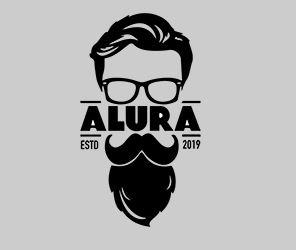

# Barbearia Alura

<p align="center">
  
</p>


# Sobre o Projeto

Site Barbearia Alura (Cursos Alura HTML e CSS)


#### 

Projeto realizado após a conclusão dos cursos:

HTML5 E CSS3 PARTE 1 A PRIMEIRA PÁGINA DA WEB;
HTML5 E CSS3 PARTE 2 POSICIONAMENTO, LISTAS E NAVEGAÇÃO;
HTML5 E CSS3 PARTE 3 TRABALHANDO COM FORMULÁRIOS E TABELAS;
HTML5 E CSS3 PARTE 4 AVANÇANDO NO CSS;

Com a criação do projeto foi possível aplicar os conhecimentos adquiridos e melhorias na aplicação inicial do projeto. 

**Desafios propostos e concluídos:** Padronização do página HOME, CONTATOS e reinderização das páginas para telas até 480px.
<h4>
  
## Layout responsivo
 

<p align="center">

</p>

## Link do projeto

#### https://barbearia-alura-versao-responsiva.netlify.app

# Tecnologias utilizadas
  
## Front end
- CSS
- HTML
  
## Implementação em produção
- Front end web: Netlify
  
# Como executar o projeto

## Front end
Pré-requisitos: npm / yarn

```bash
# clonar repositório
  
git clone https://github.com/OseiasLissak/ProjetoBarbeariaAlura.git

# entrar na pasta do projeto ProjetoBarbeariaAlura
cd ProjetoBarbeariaAlura


# instalar dependências
yarn install

# executar o projeto
yarn start
```  
  
# Autor
  
Oseias Lissak dos Santos
  
www.linkedin.com/in/oseiaslissak

